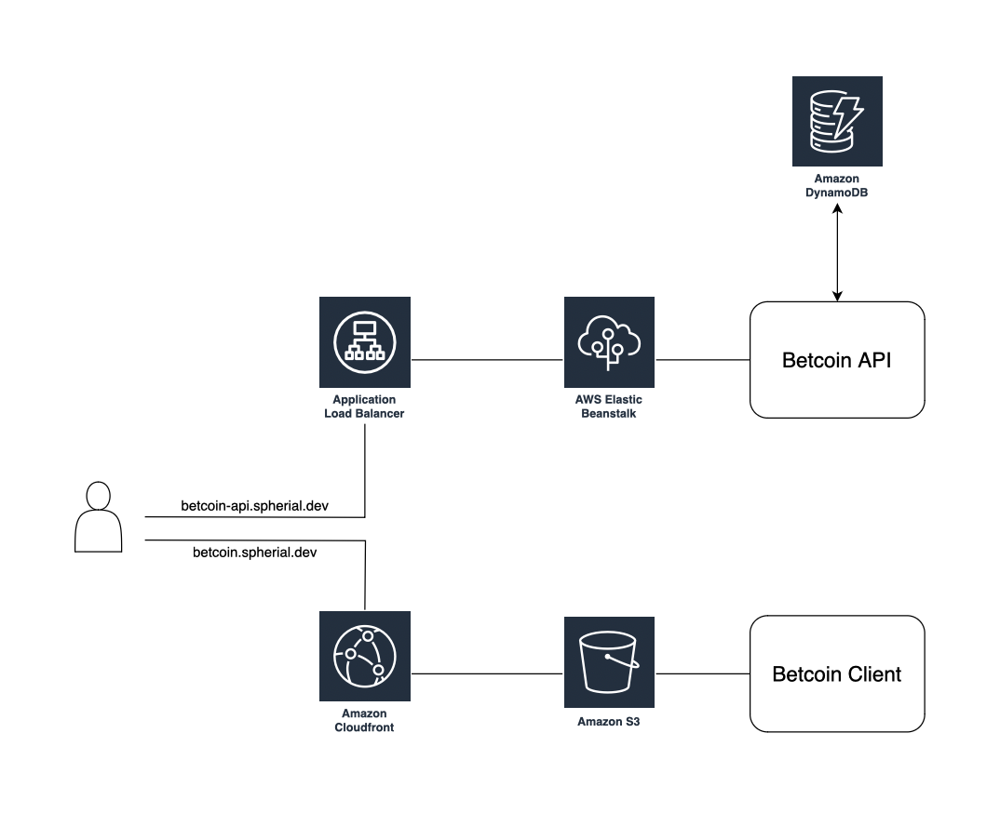

# Bet Coin

## Introduction

Bet Coin is a simple BTC price betting game. Users can submit guesses on whether the market price of Bitcoin (BTC/USD) will be higher or lower after one minute and gain points for right predictions.

You can find the current version of the game at [https://betcoin.spherial.dev](https://betcoin.spherial.dev).

### System Status

| Service | Health | Deployment Status |
| --- | --- | ---|
| Betcoin Client|  | [](https://github.com/derjayjay/betcoin/actions/workflows/deploy_client.yml) |
| Betcoin API|  | [](https://github.com/derjayjay/betcoin/actions/workflows/deploy_backend.yml) |

### Game Rules

- The player can at all times see their current score and the latest available BTC price in USD
- The player can choose to enter a guess of either “up” or “down“
- After a guess is entered the player cannot make new guesses until the existing guess is resolved
- The guess is resolved when the price changes and at least 60 seconds have passed since the guess was made
  - If the guess is correct (up = price went higher, down = price went lower), the user gets 1 point added to their score.
  - If the guess is incorrect, the user loses 1 point.
- Players can only make one guess at a time
- New players start with a score of 0

## Getting started

The repository contains two subfolders, `./client` and `./backend`, for the respective subproject.

### Running the client locally

To run the client locally, enter the `./client` folder and install the Node dependencies. Copy the content of `.env.template` to a new file `.env` and update it whereever your backend is running.

Finally, you can launch the client.

``` bash
cd client
npm ci
cp .env.template .env

# Update VITE_BACKEND_URL in .env

npm run dev
```

### Running the backend locally

#### Prerequisite

To run the backend locally, access to DynamoDB is required. You can

- use an instance in the cloud on AWS
- run DynamoDB locally using Docker
- use the build in DynamoDB in the [NoSQL Workbench](https://docs.aws.amazon.com/amazondynamodb/latest/developerguide/workbench.html)

Create a new table in your DynamoDB with a name of your chosing. Use `pk` for the partition key and `sk` for the sort key.

#### Configuration and Launch

Enter the `./backend` folder and install the Node dependencies. Copy the content of `.env.template` to a new file `.env` and update the settings. Most settings can be left untouched, but you need to update the following variables:

- `PORT`: use whatever port is available on your machine. Remember to update the URL in the client configuration if you change the port
- `CORS_ORIGIN`: replace the astersik with the port where the client is running
- `DYNAMODB_AWS_REGION`: set to the AWS region when running an AWS DynamoDB instance, otherwise leave unchanged
- `DYNAMODB_ENDPOINT`: set to the DynamoDB url when using Docker or NoSQL Workbench or remove the variable when using an AWS instance
- `DYNAMODB_TABLE_NAME`: set to the name of your table
- `DYNAMODB_ACCESS_KEY_ID`: set to the access key id
- `DYNAMODB_SECRET_ACCESS_KEY`: set to the secret access key

After updating and saving the file, you can finally launch the client.

``` bash
cd backend
npm ci
cp .env.template .env

# Update .env as specified above

npm run dev
```

### Unit Testing

For critical service components in the backend, unit tests are implemented and can be run using `npm run test`.

### Building for production

You can build the client using `npm run build` in the `./client` folder. The Node environment will be automatically set to `production`. The build output will be under `./client/dist`.

To build the backend, update the Node environment in the `.env` file in the `./backend` folder, modify the additonal variables to match your needs and run `npm run build`. The build output will be under `./backend/dist` ready to be processed for deployment.

## Architecture

### Infrastructure



### Tech Stack

- Betcoin Client, the frontend
  - React with TypeScript
  - Vite toolkit as dev environment
  - SWR for data fetching
  - Tailwind CSS for styling and Headless UI for some UI components
  - hosted on AWS S3 and distributed with CloudFront
- Betcoin API, the backend
  - Express.js server app with TypeScript
  - BTC prices using CoinDesk API
  - AWS DynamoDB as database
  - hosted on AWS Elastic Beanstalk
- Unit tests for backend service components using vitest
- Continuous deployment to S3 and ELB using GitHub Actions

#### Continuous Deployment

Both client and backend are automatically deployed to their respective environment when pushing to the `main` branch of this repository.

### Design Considerations

#### Data Table Design

The Betcoin backend uses AWS DynamoDB, a NoSQL database using a key-value storage concept. It provides great scalability, is fully managed, and offers attractive pay-as-you-go pricing based on actual usage. The schema-less NoSQL approach allows for very flexible data modelling, making it much simpler to adapt the data model compared to relational databases, which require migrations.

The disadvantages typically lie in limitations around query design and indexing. DynamoDB queries do not support the aggreation and sorting capabilites usually found in relational databases. The number of indexes per table is limited and maintaining them can be costly for write-intensive applications. However, these limitations do not apply to the relative simpel data model of Betcoin.

Betcoin uses a single-table design where all data is stored in one table and identified by careful usage of partioning and sorting keys:

- user profile is stored under key `{pk: 'user#{userID}', sk: 'profile'}`
- the state of a user's game is stored under key `{pk: 'user#{userID}', sk: 'game'}`
- refresh tokens for a user are stored under key `{pk: 'user#{userID}#token', sk: 'token#{tokenID}'}`
- the bets of a user are stored under key `{pk: 'user#{userID}#bets', sk: 'bet#{tokenID}'}`

This design allows to fetch all relevant data with very few querys, but comes with some limitations: while it is easy to fetch all bets of a user, it would be very slow and cost-intensive to query for all bets of all users or fetch a single bet without knowing the user's ID. A possible remedy is using a secondery index over all bet IDs.

#### BTC Price

Betcoin uses the CoinDesk API to fetch the current market price of Bitcoin. The data is updated every 30 seconds, hence Betcoin also polls the API every 30 seconds. The polling interval can be configured using the `.env` file of the backend.

The client polls the Backend for the updated price every 30 seconds. This is fine for low traffic environments such as this simple project. An alternative, more efficient solution would be to use a WebSocket to push the new prices to the client.

#### Management of Bet Resolution

...

#### Session Management

...

### API

...

### User Interface

...
