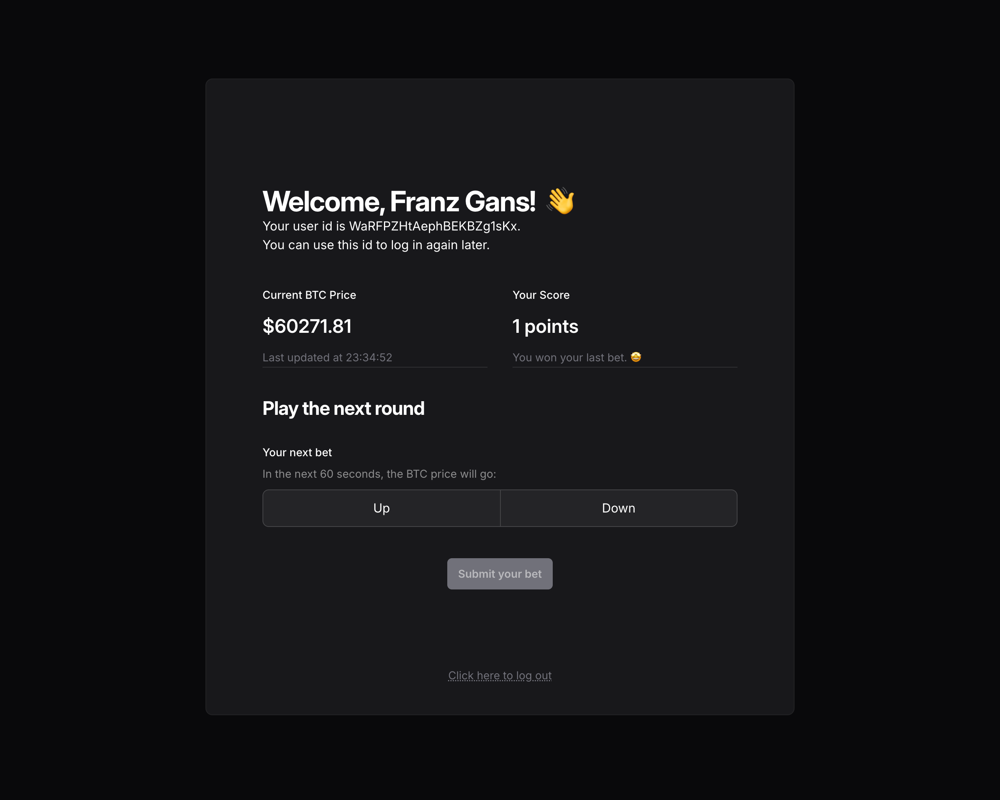

# Bet Coin

## Introduction

Bet Coin is a simple BTC price betting game. Users can submit guesses on whether the market price of Bitcoin (BTC/USD) will be higher or lower after one minute and gain points for right predictions.

You can find the current version of the game at [https://betcoin.spherial.dev](https://betcoin.spherial.dev).

### System Status

| Service | Health | Deployment Status |
| --- | --- | ---|
| Betcoin Client|  | [](https://github.com/derjayjay/betcoin/actions/workflows/deploy_client.yml) |
| Betcoin API|  | [](https://github.com/derjayjay/betcoin/actions/workflows/deploy_backend.yml) |

### Game Rules

- The player can at all times see their current score and the latest available BTC price in USD
- The player can choose to enter a guess of either “up” or “down“
- After a guess is entered the player cannot make new guesses until the existing guess is resolved
- The guess is resolved when the price changes and at least 60 seconds have passed since the guess was made
  - If the guess is correct (up = price went higher, down = price went lower), the user gets 1 point added to their score.
  - If the guess is incorrect, the user loses 1 point.
- Players can only make one guess at a time
- New players start with a score of 0

## Getting started

The repository contains two sub-folders, `./client` and `./backend`, for the respective subproject.

### Running the client locally

To run the client locally, enter the `./client` folder and install the Node dependencies. Copy the content of `.env.template` to a new file `.env` and update it wherever your backend is running.

Finally, you can launch the client.

``` bash
cd client
npm ci
cp .env.template .env

# Update VITE_BACKEND_URL in .env

npm run dev
```

### Running the backend locally

#### Prerequisite

To run the backend locally, access to DynamoDB is required. You can

- use an instance in the cloud on AWS
- run DynamoDB locally using Docker
- use the build in DynamoDB in the [NoSQL Workbench](https://docs.aws.amazon.com/amazondynamodb/latest/developerguide/workbench.html)

Create a new table in your DynamoDB with a name of your chosing. Use `pk` for the partition key and `sk` for the sort key.

#### Configuration and Launch

Enter the `./backend` folder and install the Node dependencies. Copy the content of `.env.template` to a new file `.env` and update the settings. Most settings can be left untouched, but you need to update the following variables:

- `PORT`: use whatever port is available on your machine. Remember to update the URL in the client configuration if you change the port
- `CORS_ORIGIN`: replace the asterisk with the port where the client is running
- `DYNAMODB_AWS_REGION`: set to the AWS region when running an AWS DynamoDB instance, otherwise leave unchanged
- `DYNAMODB_ENDPOINT`: set to the DynamoDB url when using Docker or NoSQL Workbench or remove the variable when using an AWS instance
- `DYNAMODB_TABLE_NAME`: set to the name of your table
- `DYNAMODB_ACCESS_KEY_ID`: set to the access key id
- `DYNAMODB_SECRET_ACCESS_KEY`: set to the secret access key

After updating and saving the file, you can finally launch the client.

``` bash
cd backend
npm ci
cp .env.template .env

# Update .env as specified above

npm run dev
```

### Unit Testing

For critical service components in the backend, unit tests are implemented and can be run using `npm run test`.

### Building for production

You can build the client using `npm run build` in the `./client` folder. The Node environment will be automatically set to `production`. The build output will be under `./client/dist`.

To build the backend, update the Node environment in the `.env` file in the `./backend` folder, modify the additonal variables to match your needs and run `npm run build`. The build output will be under `./backend/dist` ready to be processed for deployment.

## Architecture

### Infrastructure


### Tech Stack

- Betcoin Client, the frontend
  - React with TypeScript
  - Vite toolkit as dev environment
  - SWR for data fetching
  - Tailwind CSS for styling with Headless UI for some UI components
  - hosted on AWS S3 and distributed with CloudFront
- Betcoin API, the backend
  - Express.js server app with TypeScript
  - BTC prices using CoinDesk API
  - AWS DynamoDB as database
  - hosted on AWS Elastic Beanstalk
- Unit tests for backend service components using vitest
- Continuous deployment to S3 and ELB using GitHub Actions

#### Continuous Deployment

Both client and backend are automatically deployed to their respective environment when pushing to the `main` branch of this repository.

### Design Considerations

#### Data Table Design

The Betcoin backend uses AWS DynamoDB, a NoSQL database using a key-value storage concept. It provides great scalability, is fully managed, and offers attractive pay-as-you-go pricing based on actual usage. The schema-less NoSQL approach allows for very flexible data modelling, making it much simpler to adapt the data model compared to relational databases, which require migrations.

The disadvantages typically lie in limitations around query design and indexing. DynamoDB queries do not support the aggregation and sorting capabilities usually found in relational databases. The number of indexes per table is limited and maintaining them can be costly for write-intensive applications. However, these limitations do not apply to the relative simple data model of Betcoin.

Betcoin uses a single-table design where all data is stored in one table and identified by careful usage of partitioning and sorting keys:

- user profile is stored under key `{pk: 'user#{userID}', sk: 'profile'}`
- the state of a user's game is stored under key `{pk: 'user#{userID}', sk: 'game'}`
- refresh tokens for a user are stored under key `{pk: 'user#{userID}#token', sk: 'token#{tokenID}'}`
- the bets of a user are stored under key `{pk: 'user#{userID}#bets', sk: 'bet#{tokenID}'}`

This design allows to fetch all relevant data with very few queries, but comes with some limitations: while it is easy to fetch all bets of a user, it would be very slow and cost-intensive to query for all bets of all users or fetch a single bet without knowing the user's ID. A possible remedy is using a secondary index over all bet IDs.

#### BTC Price

Betcoin uses the CoinDesk API to fetch the current market price of Bitcoin. The data is updated every 30 seconds, hence Betcoin also polls the API every 30 seconds. The polling interval can be configured using the `.env` file of the backend.

The client uses the simple solution of polling the backend for the updated price every 30 seconds. This is fine for this simple project. In a large-scale system, a better approach would be to use web sockets or server-side events for price handling. Since both come with their own drawbacks and complexities, polling was the best solution for the scope of this project.

#### Management of Bet Resolution

Bets are managed by the Bet service in the backend. After submission of a new bet, the automatic resolution is scheduled. Scheduling is implemented using Node.js timers since they are lightweight and have a low overhead. This approach works reliable enough for the scope of this project to not warrant the additional resources required for job scheduling systems such as Agenda or Bull.

A freshly submitted bet starts with the status `open`. When resolving, the Bet service checks the current price and the predicted direction, updates the user score accordingly and sets the bet state to either `won` or `lost`. For reasons of fairness, there are two additional states: in case the price did not change, possibly because of an issue fetching the current price, the bet state is set to `draw`. In case the submission of an open bet was over 90 seconds ago, the bet state is set to `expired` since it is guaranteed no longer possible to determin the BTC price at the point the bet should have been resolved. In both cases, the user's score is not updated.

To ensure the user is not deadlocked because of the scheduled resolution having failed, e.g. due to a server restart, fetching a bet or trying to submit a new one will automatically expire open, overdue bets.

#### Session Management

Betcoin uses JSON Web Tokens to handle authentication. Access and refresh tokens are stored in HTTP-only cookies. The access tokens have a short lifespan (5 min by default); the client uses a custom Axios interceptor that tries to automatically refresh the tokens on requests failing with `401 - Unauthorized`. Refresh tokens are stored in the database by the backend. They are removed on refresh and logout, but expired tokens are not automatically deleted. Since these tokens are no longer valid, they do not pose a risk worth the effort for a specific scheduled clean-up task.

User are automatically logged in upon successful registration. They can also log in using their user ID, provided in the main UI. Calls against the user account related endpoints are more strictly rate-limited in order to prevent brute forcing. Together with the cryptographical randomness of the user ID, this provides "good enough" security for the nature of this project.

The session management system allows for a user to be logged simultaneous in multipe sessions. The use of SWR in the client ensures that the user interface remains mostly in sync when interacting with the game.

### API

A Postman collection for the Betcoin API can be found [here](./doc/Betcoin%20API.postman_collection.json).

### User Interface

Here is a small preview of the game's user interface. If the embed does not work, you can find the image under [./doc/betcoin_ui.webp](./doc/betcoin_ui.webp).


